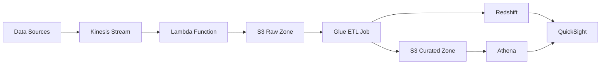

# Real-Time Data Lake and Analytics Platform on AWS

## Overview
This project implements a scalable real-time data lake and analytics platform on AWS. It provides end-to-end data processing from ingestion to visualization, enabling real-time analytics and insights.

### Key Features
- Real-time data ingestion using Kinesis
- Serverless data processing with Lambda
- ETL transformations using AWS Glue
- Data warehousing with Amazon Redshift
- Ad-hoc querying with Amazon Athena
- Data visualization with Amazon QuickSight
- Infrastructure as Code using Terraform
- Automated workflow orchestration with Step Functions

## Architecture



### Data Flow
1. **Data Ingestion**: Real-time data is captured through Kinesis Data Streams
2. **Initial Processing**: Lambda function processes and stages data in S3 raw zone
3. **ETL Processing**: Glue jobs transform and clean the data
4. **Data Storage**: 
   - Transformed data stored in S3 curated zone (Parquet format)
   - Aggregated data loaded into Redshift for analytics
5. **Data Access**:
   - Ad-hoc queries via Athena on S3 data
   - Analytics and visualization through QuickSight

## Prerequisites

### Required Tools
- AWS CLI (v2.x)
- Terraform (v1.x)
- Python 3.9+
- zip utility

### AWS Account Setup
1. Configure AWS CLI with appropriate credentials:
```bash
aws configure
```

2. Required AWS Services Access:
   - Amazon S3
   - Amazon Kinesis
   - AWS Lambda
   - AWS Glue
   - Amazon Redshift
   - AWS Step Functions
   - Amazon Athena
   - Amazon QuickSight
   - AWS IAM

## Project Structure
```
real-time-data-lake/
├── terraform/                 # Infrastructure as Code
│   ├── main.tf               # Main Terraform configuration
│   ├── variables.tf          # Terraform variables
│   └── modules/              # Terraform modules
├── glue-scripts/             # ETL Scripts
│   └── transform_data.py     # Glue ETL job script
├── lambda/                   # Lambda Functions
│   ├── kinesis_ingest.py     # Kinesis processor
│   └── package.sh           # Lambda packaging script
├── data/                     # Sample Data
│   └── sample_input.json     # Test data
└── README.md                 # Documentation
```

## Deployment

### 1. Package Lambda Function
```bash
cd lambda
./package.sh
cd ..
```

### 2. Deploy Infrastructure
```bash
cd terraform
terraform init
terraform apply
```

### 3. Test the Pipeline
Send sample data to Kinesis:
```bash
aws kinesis put-record \
  --stream-name realtime-datalake-stream \
  --partition-key user123 \
  --data fileb://data/sample_input.json
```

## Data Processing

### Sample Data Format
```json
{
    "timestamp": "2024-03-20T10:00:00Z",
    "user_id": "user123",
    "event_type": "page_view",
    "data": {
        "page_url": "https://example.com/products",
        "product_id": "prod456",
        "category": "electronics",
        "session_id": "sess789",
        "device_type": "mobile",
        "location": {
            "country": "US",
            "city": "San Francisco"
        }
    }
}
```

### ETL Transformations
The Glue job performs the following transformations:
1. Reads JSON data from S3 raw zone
2. Extracts key fields (timestamp, user_id, event_type, data)
3. Writes transformed data to S3 curated zone in Parquet format
4. Loads aggregated data into Redshift

## Monitoring and Maintenance

### CloudWatch Metrics
- Kinesis: IncomingRecords, GetRecords.IteratorAgeMilliseconds
- Lambda: Invocations, Duration, Errors
- Glue: JobRunStatus, JobRunTime
- Redshift: CPUUtilization, DatabaseConnections

### Cost Optimization
- Use appropriate instance types for Redshift
- Implement data lifecycle policies in S3
- Monitor and adjust Kinesis shard count
- Set up CloudWatch alarms for cost thresholds

## Security

### Data Protection
- S3 bucket encryption enabled
- Kinesis encryption at rest
- Redshift encryption enabled
- IAM roles with least privilege
- VPC endpoints for private access

### Access Control
- IAM roles for each service
- S3 bucket policies
- Redshift user permissions
- QuickSight user management

## Cleanup
To remove all resources:
```bash
cd terraform
terraform destroy
```

## Troubleshooting

### Common Issues
1. **Lambda Timeout**
   - Check Lambda function timeout settings
   - Monitor memory usage

2. **Glue Job Failures**
   - Verify input data format
   - Check IAM permissions
   - Review CloudWatch logs

3. **Redshift Connection Issues**
   - Verify security group settings
   - Check network connectivity
   - Validate credentials

## Contributing
1. Fork the repository
2. Create a feature branch
3. Commit your changes
4. Push to the branch
5. Create a Pull Request

## License
This project is licensed under the MIT License - see the LICENSE file for details.

## Support
For issues and feature requests, please create an issue in the repository.


---

